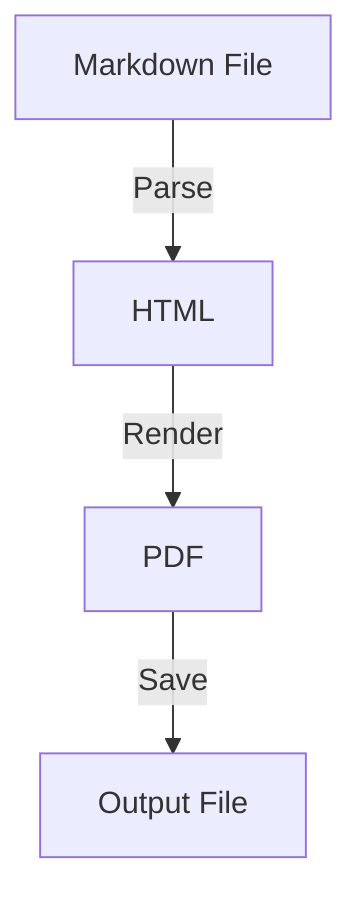

# Markdown to PDF Rendering Example

## Overview

This example demonstrates how to convert Markdown content to a beautifully formatted PDF document with support for multiple pages, syntax highlighting, and various Markdown features.

## Complete Implementation

### 1. Markdown Parser and Renderer

```typescript
// markdown-renderer.ts
import { marked } from 'marked';
import hljs from 'highlight.js';
import { JSDOM } from 'jsdom';

export class MarkdownRenderer {
  private marked: typeof marked;

  constructor() {
    // Configure marked options
    this.marked = marked;
    
    // Set options
    this.marked.setOptions({
      gfm: true,
      breaks: true,
      pedantic: false,
      smartLists: true,
      smartypants: true,
      highlight: (code, lang) => {
        if (lang && hljs.getLanguage(lang)) {
          return hljs.highlight(code, { language: lang }).value;
        }
        return hljs.highlightAuto(code).value;
      }
    });

    // Custom renderer
    const renderer = new marked.Renderer();
    
    // Custom heading renderer with anchors
    renderer.heading = (text, level) => {
      const slug = text.toLowerCase().replace(/[^\w]+/g, '-');
      return `<h${level} id="${slug}" class="heading-${level}">${text}</h${level}>`;
    };

    // Custom table renderer with better styling
    renderer.table = (header, body) => {
      return `<div class="table-wrapper">
        <table class="markdown-table">
          <thead>${header}</thead>
          <tbody>${body}</tbody>
        </table>
      </div>`;
    };

    // Custom code block renderer
    renderer.code = (code, language) => {
      const highlighted = language && hljs.getLanguage(language)
        ? hljs.highlight(code, { language }).value
        : hljs.highlightAuto(code).value;
      
      return `<div class="code-block">
        <div class="code-header">${language || 'code'}</div>
        <pre><code class="hljs ${language}">${highlighted}</code></pre>
      </div>`;
    };

    // Custom image renderer with captions
    renderer.image = (href, title, text) => {
      const caption = title ? `<figcaption>${title}</figcaption>` : '';
      return `<figure class="image-figure">
        
        ${caption}
      </figure>`;
    };

    this.marked.use({ renderer });
  }

  render(markdown: string): string {
    return this.marked.parse(markdown);
  }

  // Split content into pages based on headings or explicit breaks
  splitIntoPages(markdown: string, maxHeight: number = 900): string[] {
    const html = this.render(markdown);
    const dom = new JSDOM(html);
    const document = dom.window.document;
    
    const pages: string[] = [];
    let currentPage = '';
    let currentHeight = 0;
    
    const elements = Array.from(document.body.children);
    
    for (const element of elements) {
      const elementHtml = element.outerHTML;
      const estimatedHeight = this.estimateHeight(element);
      
      // Check for explicit page break
      if (element.classList.contains('page-break')) {
        if (currentPage) {
          pages.push(currentPage);
          currentPage = '';
          currentHeight = 0;
        }
        continue;
      }
      
      // Check if adding this element would exceed page height
      if (currentHeight + estimatedHeight > maxHeight && currentPage) {
        pages.push(currentPage);
        currentPage = elementHtml;
        currentHeight = estimatedHeight;
      } else {
        currentPage += elementHtml;
        currentHeight += estimatedHeight;
      }
    }
    
    // Add final page
    if (currentPage) {
      pages.push(currentPage);
    }
    
    return pages;
  }

  private estimateHeight(element: Element): number {
    // Rough estimation based on element type and content
    const baseHeights = {
      h1: 60,
      h2: 50,
      h3: 40,
      h4: 35,
      h5: 30,
      h6: 25,
      p: 25,
      pre: 40,
      ul: 30,
      ol: 30,
      table: 50,
      figure: 200,
      blockquote: 40
    };

    const tagName = element.tagName.toLowerCase();
    let height = baseHeights[tagName] || 30;

    // Adjust for content length
    const textLength = element.textContent?.length || 0;
    if (tagName === 'p' || tagName === 'li') {
      height += Math.floor(textLength / 80) * 20; // Roughly 80 chars per line
    }

    // Add extra height for code blocks
    if (tagName === 'pre') {
      const lines = element.textContent?.split('\n').length || 1;
      height = lines * 20 + 40; // 20px per line plus padding
    }

    return height;
  }
}
```

### 2. PDF Generator Service

```typescript
// markdown-pdf-generator.ts
import puppeteer from 'puppeteer';
import { MarkdownRenderer } from './markdown-renderer';
import { PDFDocument } from 'pdf-lib';
import * as fs from 'fs/promises';

export interface MarkdownPDFOptions {
  format?: 'letter' | 'a4';
  margins?: {
    top: string;
    right: string;
    bottom: string;
    left: string;
  };
  headerTemplate?: string;
  footerTemplate?: string;
  displayHeaderFooter?: boolean;
  theme?: 'github' | 'academic' | 'minimal';
}

export class MarkdownPDFGenerator {
  private renderer: MarkdownRenderer;

  constructor() {
    this.renderer = new MarkdownRenderer();
  }

  async generatePDF(
    markdownContent: string,
    options: MarkdownPDFOptions = {}
  ): Promise<Buffer> {
    const browser = await puppeteer.launch({
      headless: true,
      args: ['--no-sandbox', '--disable-setuid-sandbox']
    });

    try {
      const page = await browser.newPage();
      
      // Split content into pages
      const pages = this.renderer.splitIntoPages(markdownContent);
      const pdfBuffers: Buffer[] = [];

      // Generate each page
      for (let i = 0; i < pages.length; i++) {
        const html = this.generateHTML(pages[i], i + 1, pages.length, options);
        
        await page.setContent(html, { waitUntil: 'networkidle0' });
        
        const pdf = await page.pdf({
          format: options.format || 'letter',
          margin: options.margins || {
            top: '1in',
            right: '1in',
            bottom: '1in',
            left: '1in'
          },
          displayHeaderFooter: options.displayHeaderFooter ?? true,
          headerTemplate: options.headerTemplate || this.getDefaultHeader(),
          footerTemplate: options.footerTemplate || this.getDefaultFooter(),
          printBackground: true
        });

        pdfBuffers.push(pdf);
      }

      // Merge all pages
      return await this.mergePDFs(pdfBuffers);

    } finally {
      await browser.close();
    }
  }

  private generateHTML(
    content: string,
    pageNumber: number,
    totalPages: number,
    options: MarkdownPDFOptions
  ): string {
    const theme = this.getThemeStyles(options.theme || 'github');
    
    return `
      <!DOCTYPE html>
      <html>
      <head>
        <meta charset="UTF-8">
        <style>
          ${theme}
          ${this.getHighlightStyles()}
          
          @page {
            size: ${options.format || 'letter'};
          }
          
          body {
            font-family: -apple-system, BlinkMacSystemFont, 'Segoe UI', 'Helvetica Neue', Arial, sans-serif;
            line-height: 1.6;
            color: #333;
            max-width: 100%;
            margin: 0;
            padding: 0;
          }
          
          .page-content {
            min-height: 100vh;
            box-sizing: border-box;
          }
          
          /* Headings */
          h1, h2, h3, h4, h5, h6 {
            margin-top: 24px;
            margin-bottom: 16px;
            font-weight: 600;
            line-height: 1.25;
            page-break-after: avoid;
          }
          
          h1 { font-size: 2em; border-bottom: 1px solid #eee; padding-bottom: 0.3em; }
          h2 { font-size: 1.5em; }
          h3 { font-size: 1.25em; }
          h4 { font-size: 1em; }
          h5 { font-size: 0.875em; }
          h6 { font-size: 0.85em; color: #666; }
          
          /* Paragraphs and text */
          p {
            margin-bottom: 16px;
            orphans: 3;
            widows: 3;
          }
          
          /* Lists */
          ul, ol {
            margin-bottom: 16px;
            padding-left: 2em;
          }
          
          li {
            margin-bottom: 4px;
          }
          
          /* Code blocks */
          .code-block {
            margin: 16px 0;
            border-radius: 6px;
            overflow: hidden;
            page-break-inside: avoid;
          }
          
          .code-header {
            background: #f6f8fa;
            padding: 8px 16px;
            font-size: 12px;
            color: #666;
            border-bottom: 1px solid #e1e4e8;
          }
          
          pre {
            margin: 0;
            padding: 16px;
            overflow-x: auto;
            background: #f6f8fa;
          }
          
          code {
            background: #f6f8fa;
            padding: 2px 4px;
            border-radius: 3px;
            font-family: 'SF Mono', Consolas, 'Liberation Mono', Menlo, monospace;
            font-size: 85%;
          }
          
          pre code {
            background: none;
            padding: 0;
          }
          
          /* Tables */
          .table-wrapper {
            margin: 16px 0;
            overflow-x: auto;
            page-break-inside: avoid;
          }
          
          .markdown-table {
            border-collapse: collapse;
            width: 100%;
          }
          
          .markdown-table th,
          .markdown-table td {
            padding: 8px 12px;
            border: 1px solid #ddd;
          }
          
          .markdown-table th {
            background: #f6f8fa;
            font-weight: 600;
            text-align: left;
          }
          
          .markdown-table tr:nth-child(even) {
            background: #f9f9f9;
          }
          
          /* Images */
          .image-figure {
            margin: 16px 0;
            text-align: center;
            page-break-inside: avoid;
          }
          
          .image-figure img {
            max-width: 100%;
            height: auto;
          }
          
          .image-figure figcaption {
            margin-top: 8px;
            font-size: 14px;
            color: #666;
            font-style: italic;
          }
          
          /* Blockquotes */
          blockquote {
            margin: 16px 0;
            padding: 0 1em;
            color: #666;
            border-left: 4px solid #ddd;
          }
          
          /* Links */
          a {
            color: #0366d6;
            text-decoration: none;
          }
          
          a:hover {
            text-decoration: underline;
          }
          
          /* Page info */
          .page-info {
            position: fixed;
            bottom: 20px;
            right: 20px;
            font-size: 10px;
            color: #999;
          }
        </style>
      </head>
      <body>
        <div class="page-content">
          ${content}
        </div>
        <div class="page-info" style="display: none;">
          Page ${pageNumber} of ${totalPages}
        </div>
      </body>
      </html>
    `;
  }

  private getThemeStyles(theme: string): string {
    const themes = {
      github: `
        body { background: white; }
        h1, h2 { border-bottom: 1px solid #eee; }
        code { background: #f6f8fa; }
      `,
      academic: `
        body { font-family: 'Times New Roman', serif; font-size: 12pt; }
        h1 { font-size: 18pt; text-align: center; }
        h2 { font-size: 14pt; }
        p { text-align: justify; text-indent: 0.5in; }
      `,
      minimal: `
        body { font-family: 'Helvetica Neue', sans-serif; }
        h1, h2, h3 { border: none; }
        code { background: #f0f0f0; }
      `
    };

    return themes[theme] || themes.github;
  }

  private getHighlightStyles(): string {
    // GitHub-style syntax highlighting
    return `
      .hljs { background: #f6f8fa; color: #24292e; }
      .hljs-keyword { color: #d73a49; }
      .hljs-string { color: #032f62; }
      .hljs-number { color: #005cc5; }
      .hljs-comment { color: #6a737d; }
      .hljs-function { color: #6f42c1; }
      .hljs-class { color: #e36209; }
      .hljs-variable { color: #005cc5; }
      .hljs-built_in { color: #005cc5; }
    `;
  }

  private getDefaultHeader(): string {
    return `
      <div style="font-size: 10px; color: #666; width: 100%; text-align: center;">
        <span class="title"></span>
      </div>
    `;
  }

  private getDefaultFooter(): string {
    return `
      <div style="font-size: 10px; color: #666; width: 100%; text-align: center;">
        <span class="pageNumber"></span> / <span class="totalPages"></span>
      </div>
    `;
  }

  private async mergePDFs(pdfBuffers: Buffer[]): Promise<Buffer> {
    const mergedPdf = await PDFDocument.create();

    for (const buffer of pdfBuffers) {
      const pdf = await PDFDocument.load(buffer);
      const pages = await mergedPdf.copyPages(pdf, pdf.getPageIndices());
      
      for (const page of pages) {
        mergedPdf.addPage(page);
      }
    }

    return Buffer.from(await mergedPdf.save());
  }
}
```

### 3. API Endpoint

```typescript
// markdown-pdf-api.ts
import express from 'express';
import { MarkdownPDFGenerator } from './markdown-pdf-generator';
import multer from 'multer';

const router = express.Router();
const generator = new MarkdownPDFGenerator();
const upload = multer({ storage: multer.memoryStorage() });

// Generate PDF from markdown text
router.post('/generate', express.json(), async (req, res) => {
  try {
    const { markdown, options } = req.body;

    if (!markdown) {
      return res.status(400).json({ error: 'Markdown content is required' });
    }

    const pdf = await generator.generatePDF(markdown, options);

    res.set({
      'Content-Type': 'application/pdf',
      'Content-Disposition': 'attachment; filename="document.pdf"',
      'Content-Length': pdf.length
    });

    res.send(pdf);

  } catch (error) {
    console.error('PDF generation error:', error);
    res.status(500).json({ error: 'Failed to generate PDF' });
  }
});

// Generate PDF from uploaded markdown file
router.post('/upload', upload.single('file'), async (req, res) => {
  try {
    if (!req.file) {
      return res.status(400).json({ error: 'No file uploaded' });
    }

    const markdown = req.file.buffer.toString('utf-8');
    const options = req.body.options ? JSON.parse(req.body.options) : {};

    const pdf = await generator.generatePDF(markdown, options);

    res.set({
      'Content-Type': 'application/pdf',
      'Content-Disposition': `attachment; filename="${req.file.originalname.replace('.md', '.pdf')}"`,
      'Content-Length': pdf.length
    });

    res.send(pdf);

  } catch (error) {
    console.error('PDF generation error:', error);
    res.status(500).json({ error: 'Failed to generate PDF' });
  }
});

export { router as markdownPDFRouter };
```

### 4. Sample Markdown Content

```markdown
# Technical Documentation Example

This document demonstrates the conversion of Markdown to PDF with various formatting features.

## Table of Contents

1. [Introduction](#introduction)
2. [Code Examples](#code-examples)
3. [Tables and Lists](#tables-and-lists)
4. [Mathematical Formulas](#mathematical-formulas)
5. [Images and Diagrams](#images-and-diagrams)

<div class="page-break"></div>

## Introduction

This PDF was generated from **Markdown** content using *Puppeteer* and custom styling. The document supports:

- Multiple pages with automatic pagination
- Syntax highlighted code blocks
- Tables with proper formatting
- Images with captions
- Custom themes

### Features

The markdown renderer supports [GitHub Flavored Markdown](https://github.github.com/gfm/) including:

> **Note:** All standard markdown features are supported including blockquotes, horizontal rules, and nested lists.

---

## Code Examples

### JavaScript Example

```javascript
// Fibonacci sequence generator
function* fibonacci() {
  let [prev, curr] = [0, 1];
  while (true) {
    yield curr;
    [prev, curr] = [curr, prev + curr];
  }
}

// Usage
const fib = fibonacci();
console.log(fib.next().value); // 1
console.log(fib.next().value); // 1
console.log(fib.next().value); // 2
```

### Python Example

```python
# Decorator example
import time
from functools import wraps

def timing_decorator(func):
    @wraps(func)
    def wrapper(*args, **kwargs):
        start = time.time()
        result = func(*args, **kwargs)
        end = time.time()
        print(f"{func.__name__} took {end - start:.4f} seconds")
        return result
    return wrapper

@timing_decorator
def slow_function():
    time.sleep(1)
    return "Done!"
```

<div class="page-break"></div>

## Tables and Lists

### Comparison Table

| Feature | Markdown | HTML | PDF |
|---------|----------|------|-----|
| Easy to write | ✅ Yes | ❌ No | ❌ No |
| Portable | ✅ Yes | ⚠️ Partial | ✅ Yes |
| Formatting | ⚠️ Limited | ✅ Full | ✅ Full |
| Version Control | ✅ Excellent | ⚠️ OK | ❌ Poor |

### Nested Lists

1. **Frontend Technologies**
   - React
     - Hooks
     - Context API
     - Server Components
   - Vue.js
     - Composition API
     - Vuex
   - Angular
     - RxJS
     - Dependency Injection

2. **Backend Technologies**
   - Node.js
     - Express
     - NestJS
   - Python
     - Django
     - FastAPI
   - Go
     - Gin
     - Echo

## Mathematical Formulas

When rendering mathematical content, you can use LaTeX notation:

The quadratic formula: $x = \frac{-b \pm \sqrt{b^2 - 4ac}}{2a}$

Euler's identity: $e^{i\pi} + 1 = 0$

## Images and Diagrams


### Mermaid Diagrams (when supported)



<div class="page-break"></div>

## Conclusion

This example demonstrates the power of converting Markdown to PDF while maintaining:

- **Typography**: Professional fonts and spacing
- **Code Highlighting**: Syntax-aware colorization
- **Layout**: Proper page breaks and margins
- **Styling**: Consistent theme throughout

### Next Steps

1. Customize the theme to match your brand
2. Add custom headers and footers
3. Include table of contents generation
4. Support for citations and references

---

*Generated on: [date] | Version: 1.0.0*
```

### 5. Client Usage Example

```html
<!DOCTYPE html>
<html>
<head>
    <title>Markdown to PDF Converter</title>
    <style>
        body {
            font-family: -apple-system, BlinkMacSystemFont, 'Segoe UI', sans-serif;
            max-width: 1200px;
            margin: 0 auto;
            padding: 20px;
        }
        
        .container {
            display: grid;
            grid-template-columns: 1fr 1fr;
            gap: 20px;
            height: calc(100vh - 200px);
        }
        
        textarea {
            width: 100%;
            height: 100%;
            padding: 10px;
            border: 1px solid #ddd;
            border-radius: 4px;
            font-family: monospace;
            font-size: 14px;
        }
        
        .preview {
            border: 1px solid #ddd;
            border-radius: 4px;
            padding: 20px;
            overflow-y: auto;
            background: white;
        }
        
        .controls {
            margin: 20px 0;
            display: flex;
            gap: 10px;
            align-items: center;
        }
        
        button {
            padding: 10px 20px;
            background: #007bff;
            color: white;
            border: none;
            border-radius: 4px;
            cursor: pointer;
        }
        
        button:hover {
            background: #0056b3;
        }
        
        select {
            padding: 8px;
            border: 1px solid #ddd;
            border-radius: 4px;
        }
    </style>
    <link rel="stylesheet" href="https://cdnjs.cloudflare.com/ajax/libs/github-markdown-css/5.1.0/github-markdown.min.css">
    <script src="https://cdn.jsdelivr.net/npm/marked/marked.min.js"></script>
</head>
<body>
    <h1>Markdown to PDF Converter</h1>
    
    <div class="controls">
        <button onclick="generatePDF()">Generate PDF</button>
        <select id="format">
            <option value="letter">Letter (8.5" × 11")</option>
            <option value="a4">A4 (210mm × 297mm)</option>
        </select>
        <select id="theme">
            <option value="github">GitHub</option>
            <option value="academic">Academic</option>
            <option value="minimal">Minimal</option>
        </select>
        <label>
            <input type="checkbox" id="pageNumbers" checked>
            Page Numbers
        </label>
    </div>
    
    <div class="container">
        <textarea id="markdown" placeholder="Enter your markdown here...">
# Sample Document

This is a **sample** markdown document with *various* formatting.

## Features

- Bullet points
- Code blocks
- Tables
- Images

```javascript
console.log('Hello, PDF!');
```

| Column 1 | Column 2 |
|----------|----------|
| Data 1   | Data 2   |
        </textarea>
        
        <div id="preview" class="preview markdown-body"></div>
    </div>

    <script>
        const markdownInput = document.getElementById('markdown');
        const preview = document.getElementById('preview');

        // Live preview
        function updatePreview() {
            preview.innerHTML = marked.parse(markdownInput.value);
        }

        markdownInput.addEventListener('input', updatePreview);
        updatePreview();

        // Generate PDF
        async function generatePDF() {
            const markdown = markdownInput.value;
            const format = document.getElementById('format').value;
            const theme = document.getElementById('theme').value;
            const pageNumbers = document.getElementById('pageNumbers').checked;

            try {
                const response = await fetch('/api/markdown/generate', {
                    method: 'POST',
                    headers: {
                        'Content-Type': 'application/json'
                    },
                    body: JSON.stringify({
                        markdown,
                        options: {
                            format,
                            theme,
                            displayHeaderFooter: pageNumbers
                        }
                    })
                });

                if (!response.ok) {
                    throw new Error('Failed to generate PDF');
                }

                const blob = await response.blob();
                const url = window.URL.createObjectURL(blob);
                const a = document.createElement('a');
                a.href = url;
                a.download = 'document.pdf';
                a.click();
                window.URL.revokeObjectURL(url);

            } catch (error) {
                alert('Error generating PDF: ' + error.message);
            }
        }
    </script>
</body>
</html>
```

## Advanced Features

### 1. Table of Contents Generation

```typescript
function generateTableOfContents(markdown: string): string {
  const headings = markdown.match(/^#{1,3} .+$/gm) || [];
  
  const toc = headings.map(heading => {
    const level = heading.match(/^#+/)[0].length;
    const text = heading.replace(/^#+\s+/, '');
    const slug = text.toLowerCase().replace(/[^\w]+/g, '-');
    const indent = '  '.repeat(level - 1);
    
    return `${indent}- [${text}](#${slug})`;
  }).join('\n');

  return `## Table of Contents\n\n${toc}\n\n`;
}
```

### 2. Custom Page Breaks

```typescript
// Add support for custom page break syntax
renderer.paragraph = (text) => {
  if (text === '[PAGE BREAK]') {
    return '<div class="page-break" style="page-break-after: always;"></div>';
  }
  return `<p>${text}</p>`;
};
```

### 3. Watermarks

```css
.page-content {
  position: relative;
}

.page-content::before {
  content: "CONFIDENTIAL";
  position: absolute;
  top: 50%;
  left: 50%;
  transform: translate(-50%, -50%) rotate(-45deg);
  font-size: 120px;
  color: rgba(0, 0, 0, 0.05);
  z-index: -1;
}
```

## Best Practices

1. **Use semantic markdown** for better PDF structure
2. **Include explicit page breaks** for control over layout
3. **Optimize images** before including them
4. **Test different themes** for best readability
5. **Consider accessibility** with proper heading structure

## Troubleshooting

### Common Issues

1. **Large documents timing out**
   - Split into smaller sections
   - Increase timeout settings
   - Use streaming approach

2. **Images not loading**
   - Use absolute URLs
   - Base64 encode images
   - Check CORS settings

3. **Fonts not rendering**
   - Embed fonts in CSS
   - Use web-safe fonts
   - Wait for font loading